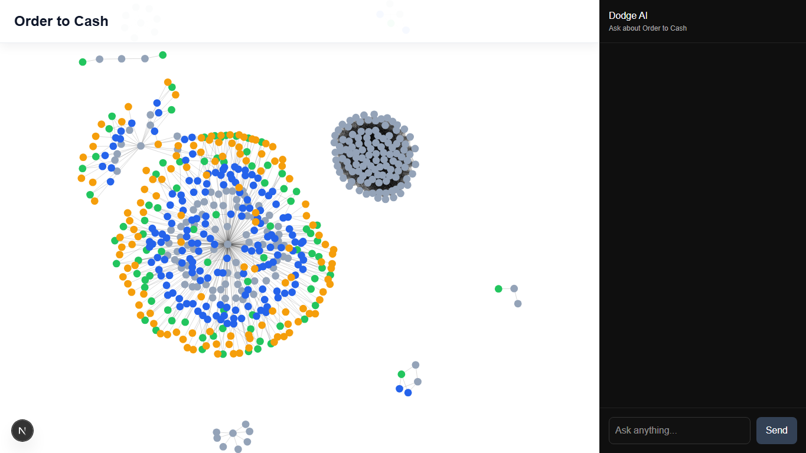

# Order to Cash Graph

Interactive Order-to-Cash graph explorer with an AI chat assistant for tracing document flows, spotting broken process chains, and answering dataset-grounded questions over the O2C schema.

Live deployment: [https://order-to-cash-graph.vercel.app/](https://order-to-cash-graph.vercel.app/)



## What This Project Does

- Visualizes Order-to-Cash entities and relationships in a force-directed graph.
- Lets users ask natural-language questions from the UI chat panel.
- Converts supported questions into PostgreSQL `SELECT` queries over the project dataset.
- Returns grounded answers and highlights the related nodes in the graph.

## Stack

- Frontend: Next.js 16, React 19, `react-force-graph-2d`
- Backend: Express, PostgreSQL, Groq API

## Project Structure

- `frontend/`: Next.js app with the graph view and chat panel
- `backend/`: Express API for graph data and question answering
- `AI_USAGE.md`: notes on prompt design and AI usage decisions

## Environment Variables

Backend (`backend/.env` or root `.env`):

```env
DATABASE_URL=your_postgres_connection_string
GROQ_API_KEY=your_groq_api_key
PORT=5000
```

Frontend optional override:

```env
NEXT_PUBLIC_API_BASE_URL=http://localhost:5000
```

If `NEXT_PUBLIC_API_BASE_URL` is not set, the frontend defaults to the deployed backend URL already configured in the app.

## Run Locally

Install dependencies:

```bash
npm install
cd frontend
npm install
```

Start the backend:

```bash
cd backend
node index.js
```

Start the frontend:

```bash
cd frontend
npm run dev
```

Open the app at `http://localhost:3000`.

## Example Questions To Try

Use these in the chat panel while the project is running:

1. Which products are associated with the highest number of billing documents?
2. Trace the full flow of a given billing document (Sales Order → Delivery → Billing → Journal Entry)
3. Identify sales orders that have broken or incomplete flows (e.g. delivered but not billed, billed without delivery)
4. 91150187 - Find the journal entry linked to this.

## Notes

- The backend only supports Order-to-Cash dataset questions.
- Generated SQL is constrained to the known schema and then executed against PostgreSQL.
- Answers are based on query results returned by the backend, not free-form chat responses.
